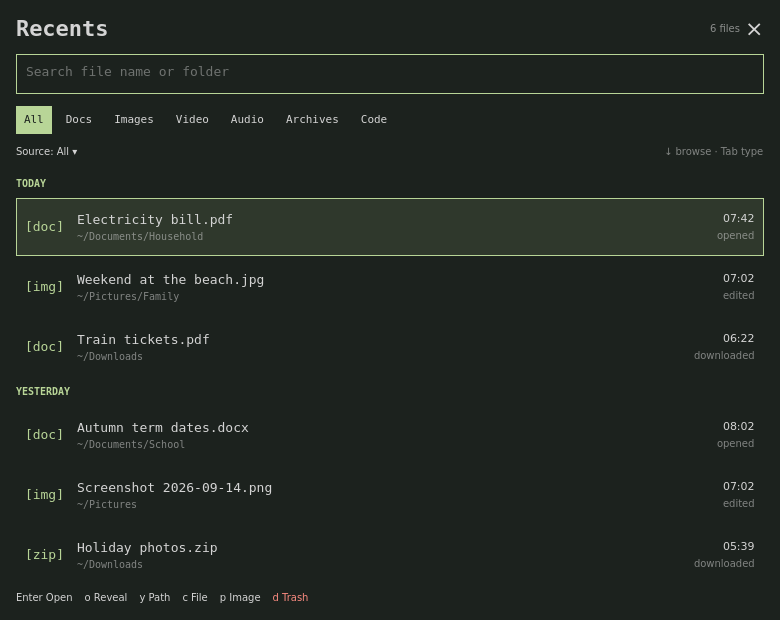

Reads file names and timestamps under your Documents, Downloads, Desktop, Pictures, Videos and Music folders. Never sends anything anywhere. Browser-download history is off unless you turn it on.

# Recents

[](https://github.com/tcballard/omarchy-badges)

**The PDF from this morning. The photo you just saved. One panel.**

A keyboard-first recent-files panel for Omarchy Quattro. Browse edited files, GTK opened-file history and optional browser downloads; filter names, folders, types and sources.



**v0.1.0 candidate.** Portable tests and fixture UI checks pass. Live Quattro lifecycle, clipboard destinations and laptop performance still need verification. This is not a marketplace-approved release. The preview renders actual QML with synthetic files and explicit host stubs.

## Install

Requires Quattro, Bash, Python 3.10+, GNU findutils/coreutils, xdg-user-dirs, xdg-utils, GLib (`gio`, `gdbus`), wl-clipboard and fontconfig. Python uses only its standard library, including SQLite for optional browser reading. No pip packages, Node runtime, compile-on-install or installation hooks.

```sh
omarchy plugin add https://github.com/tcballard/omarchy-recents.git --enable
omarchy bar move io.github.tcballard.recents --section right
```

Optionally add the following to `~/.config/hypr/bindings.conf`, checking for an existing Super+R binding first. The plugin never changes bindings. The widget must be present on an enabled bar for this bar-hosted summon route.

```ini
bindd = SUPER, R, Recents, exec, omarchy-shell shell summon io.github.tcballard.recents '{}'
```

Left-click the icon to toggle; right-click to rescan. Use Omarchy's normal plugin update mechanism to update the checkout. External config and state survive updates.

## Controls

Search has focus on opening. Letters type normally. Up/Down enters **list mode**; `/` returns to search. Click selects; double-click opens. Footer actions are clickable.

| Key | Action |
| --- | --- |
| Up / Down | Move and enter list mode |
| j / k | Move in list mode |
| Enter | Open |
| Tab / Shift+Tab | Next / previous type |
| s | Cycle source; source label is also clickable |
| o | Reveal in Files; parent-folder fallback |
| y | Copy path as text |
| c | Copy file as `text/uri-list` |
| p | Copy image bytes as the image MIME type |
| d, then d within 2 seconds | Move selected file to Trash |
| i | Toggle size/path details |
| r | Rescan |
| / | Focus search |
| Escape | Cancel Trash confirmation, otherwise close |

Letter actions apply only in list mode. Holding d cannot confirm. Selection/results changes, closing or reopening cancel confirmation. Clicking Trash also requires a second activation within two seconds. There is no permanent-delete action.

`wl-copy` advertises one MIME type per invocation, so Copy file and Copy image are separate. Apps choose what they accept: pasting files into every browser/mail upload surface is not guaranteed. Copy image reads image contents; ordinary scanning reads metadata.

## Config

Zero configuration is required. Copy `config.default.json` to `~/.config/recents/config.json` to customise, then rescan. A malformed config reports an error and preserves the last successful index.

```json
{
  "windowDays": 14,
  "maxDepth": 6,
  "extraRoots": [],
  "excludeGlobs": ["*.tmp", "*~", "*.swp"],
  "sources": {"find": true, "xbel": true, "browsers": false},
  "showTodayCount": false,
  "plainGlyphs": false,
  "openWith": {"md": ["xdg-terminal-exec", "nvim"]}
}
```

`windowDays`: 1–365. `maxDepth`: 1–12. `extraRoots`: existing directories beneath home, excluding home itself. XDG dirs resolving to home are skipped. Custom `OMARCHY_SCREENSHOT_DIR` and `OMARCHY_SCREENRECORD_DIR` under home are included. XDG config/data/state overrides are respected.

`openWith` accepts argv arrays or quoted command strings, split into arguments. The absolute selected path is appended. No shell evaluation, environment expansion or pipelines.

Popup colours and fonts follow Quattro, including live theme changes. Fontconfig checks glyph coverage; missing/unknown coverage uses plain tags such as `[doc]`. `plainGlyphs` forces these. Vertical bars omit the optional today count.

## Sources, privacy and limits

- **Edited:** GNU find uses the newer modification or inode-change timestamp. Inode change is not reliable creation time; permission changes can make files recent. Hidden paths, node_modules, temporary downloads and configured globs are excluded. Default depth: six.
- **Opened:** GTK `recently-used.xbel` visited/modified timestamps and MIME types. Only local file URIs beneath home. Coverage depends on the app: not every Linux application records opened files.
- **Downloaded, opt-in:** standard Chromium/Chrome/Brave profiles beneath XDG config, and Firefox under `~/.mozilla/firefox`. Reads History/places databases, including a temporary database copy. It does not read cookie/password databases. SQLite backup includes WAL changes and creates a consistent private copy under the owned `XDG_RUNTIME_DIR`, removed afterwards. Flatpak, Snap and custom profiles are not discovered. Unavailable schemas produce an incomplete-source notice.

Exclusions apply across sources. Paths are canonicalised; external symlinks rejected. Renames appear as new paths. Missing files are removed by an asynchronous visible-page check on opening/scrolling. Slow stat does not block the panel.

Scans start after 30 seconds, then every five minutes. A panel opening requests background refresh if its cache is over 60 seconds old. GTK metadata is polled every 15 seconds; a change requests a scan. Scheduled scans pause when a discharging battery is below 15%; explicit refresh remains available.

Each filesystem root has a 15-second deadline with partial results; all filesystem work shares a 45-second budget. Three consecutive root scans over eight seconds reduce its depth to three until `~/.local/state/recents/roots.json` is removed. The two-second warm/eight-second cold laptop goals remain unverified on target hardware.

`-xdev` prevents crossing devices, not all network access: an explicit network filesystem root can still be slow. Roots outside home are unsupported.

Only the most recent 2,000 paths are indexed. Search covers that index, using fuzzy matching and a three-day recency half-life. Date headers are hidden during ranked search. Normal browsing uses local Today, Yesterday, Monday-based This week and Earlier.

State contains paths, timestamps and source tags, written atomically with private permissions under `~/.local/state/recents`. Nothing is uploaded. Empty, failed, partial and battery-paused scans are distinct; failed scans retain the last successful index.

Walker/launcher search and Recents can coexist: this is a time-ordered browsing panel. It does not replace a launcher provider or claim that no launcher offers recents. Full-text search and thumbnails are deferred.

## Validation and removal

```sh
./tests/run
shellcheck bin/recents-scan bin/recents-act tests/run
# Optional development-only dependency:
python3 -m pip install PySide6==6.11.2
python3 tests/service_qml.py
python3 tests/render_qml.py /tmp/recents-preview.png
# On Omarchy:
omarchy plugin validate "$PWD"
qmllint -I "$OMARCHY_PATH/shell" BarWidget.qml Panel.qml Service.qml
```

See [VALIDATION.md](VALIDATION.md) and [DESIGN.md](DESIGN.md). Tests never Trash real user files.

```sh
omarchy plugin remove io.github.tcballard.recents
```

Remove the optional binding yourself. To forget metadata, remove `~/.local/state/recents`; config is under `~/.config/recents`. Removal never deletes indexed files.

MIT licensed. Suggested topics: `omarchy`, `omarchy-plugin`, `recent-files`, `quickshell`.
